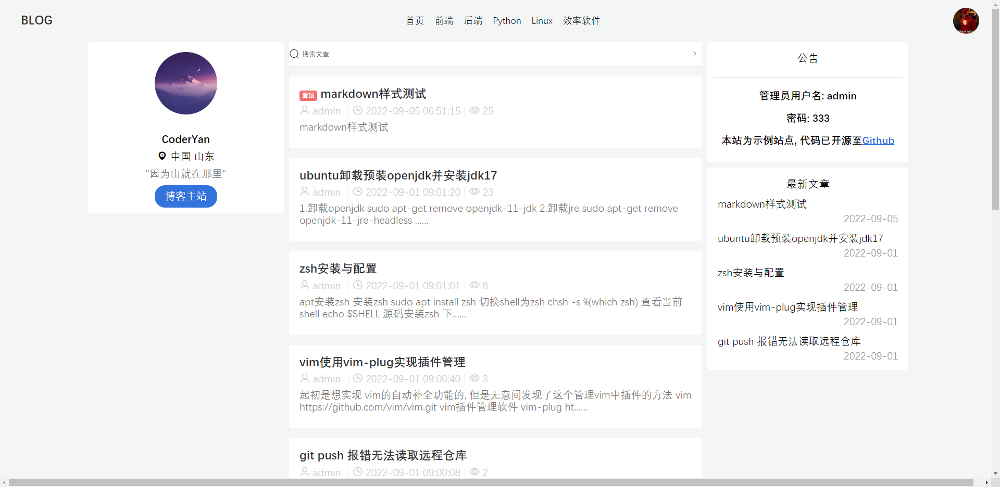
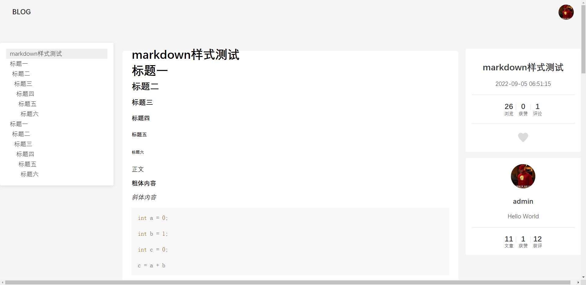
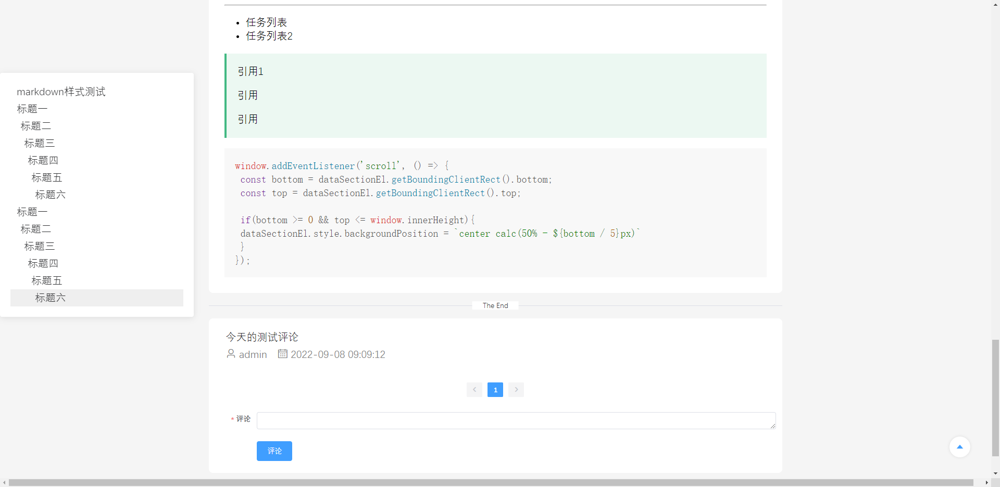
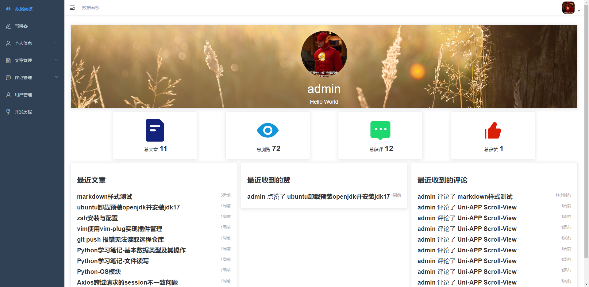
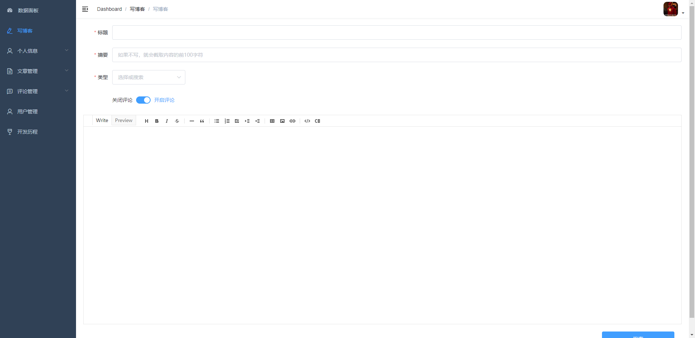
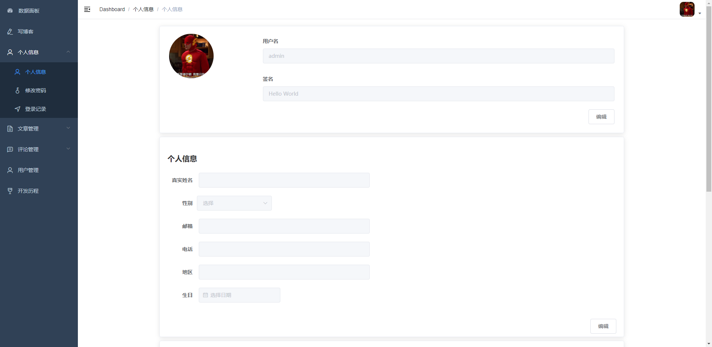
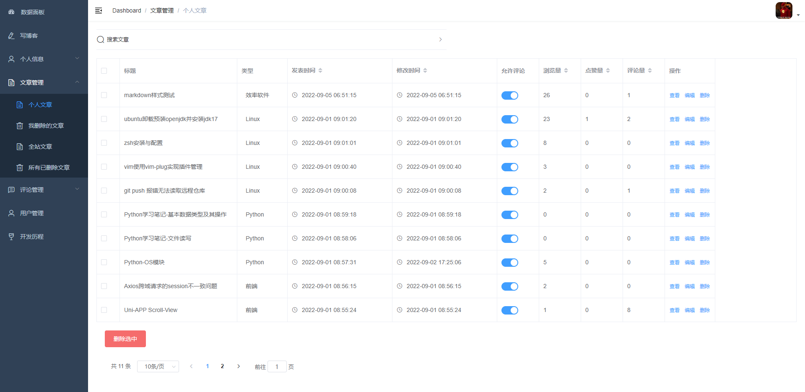
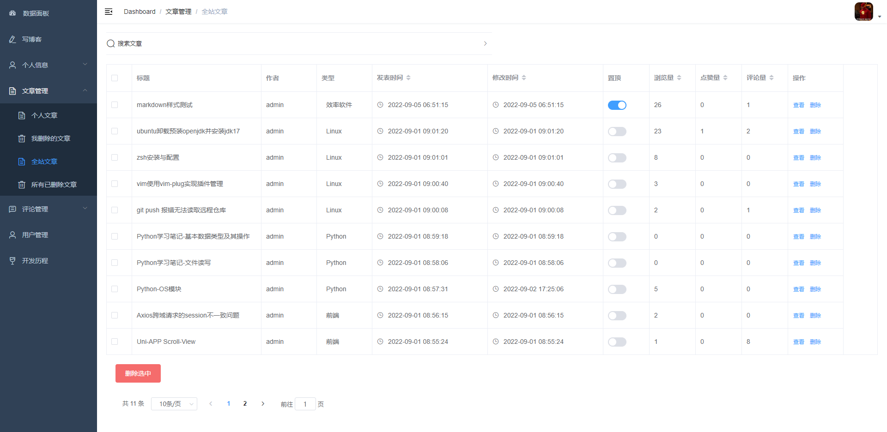
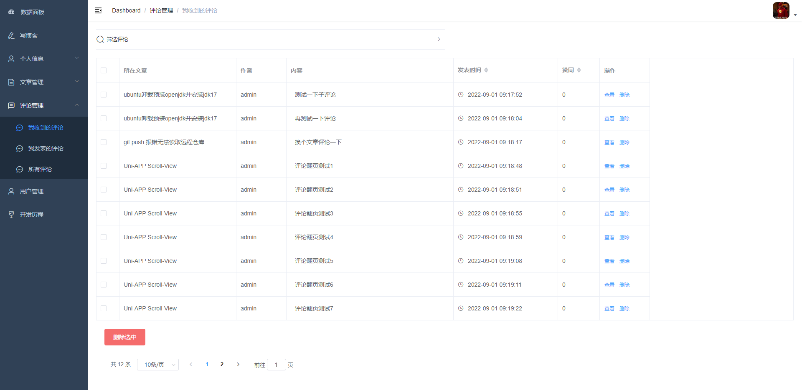
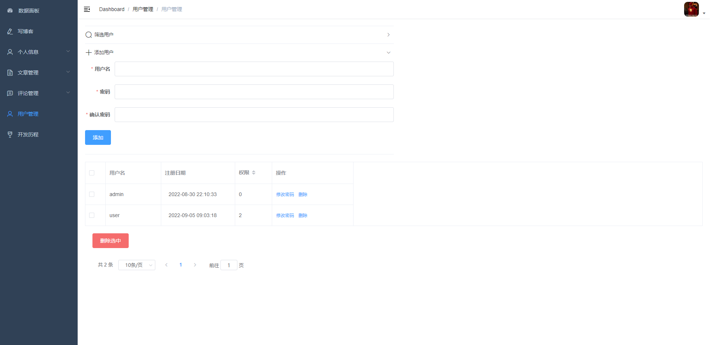

> ! 项目正在开发中
> 
> ! Under Development

# 介绍

一款基于SpringBoot和Vue.js的个人博客系统

- 预览地址: [Blog预览地址](http://demo.evilemperor.top/#/)

- 配置指南: Configuration.md

## 技术选型

> 前端

| 技术         | 官网                                                                   |
| ---------- | -------------------------------------------------------------------- |
| Vue.js 2.x | [https://cn.vuejs.org/](https://cn.vuejs.org/)                       |
| vue-cli    | [https://cli.vuejs.org/zh/guide/](https://cli.vuejs.org/zh/guide/)   |
| vue-router | [https://router.vuejs.org/zh/](https://router.vuejs.org/zh/)         |
| vuex       | [https://vuex.vuejs.org/](https://vuex.vuejs.org/)                   |
| Element-UI | [https://element.eleme.cn/#/zh-CN](https://element.eleme.cn/#/zh-CN) |
| Node.js    | [https://nodejs.org/en/](https://nodejs.org/en/)                     |

本项目使用了 Vue-Element-Admin模板

> 后端

| 技术             | 官网                                                                                 |
| -------------- | ---------------------------------------------------------------------------------- |
| SpringBoot 2.x | [https://spring.io/projects/spring-boot/](https://spring.io/projects/spring-boot/) |
| MyBatis-Plus   | [https://baomidou.com/](https://baomidou.com/)                                     |

## 预览展示

